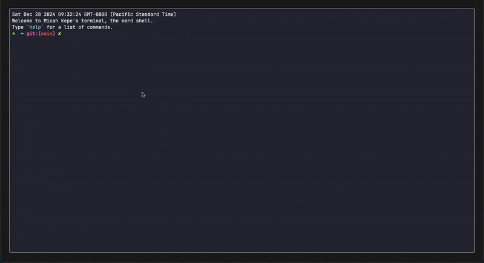

# term-website

An experimental, configurable terminal website that I built for fun. The website
is a client-side terminal emulator that runs a mock backend to simulate a shell
environment. The website is built with vanilla TypeScript, HTML, and CSS. This
site can be used as a template portfolio website or be modified to be a
full-fledged terminal emulator.

## Table of Contents

- [Overview](#overview)
- [Documentation](#documentation)
- [TODOs](#todos)
- [Configuration](#configuration)
  - [Filetree](#filetree)
  - [Commands](#commands)
  - [Terminal Themes](#terminal-themes)
  - [Shortcuts](#shortcuts)
- [Contributing](#contributing)
- [Acknowledgements](#acknowledgements)
- [License](#license)

## Overivew

The site uses [xterm.js](https://xtermjs.org/) as a client-side browser terminal
frontend emulation. As the user submits commands, they are parsed on the mock
backend for filetree navigation, help page, etc.

The website is stateless and the filetree that doesn't persistent across client
sessions. Upon refreshing, the website goes back to its initial state, which is
intended.

## Documentation

The documentation for the site can be found in the `docs/` directory. The
documentation is autogenerated with a tool called `tsdoc` that is run with the
`npm run doc` command. You can view the documentation by opening the
`docs/index.html` file in your browser.

## TODOs

- [ ] Handle TABs (autocomplete, cycle through files, etc.)
- [ ] Syntax highlighting/ Markdown rendering (no more external libs!)

## Configuration

The website is configurable via the `config.json` file for the following fields:

- `default_theme`: the default theme for the terminal
- `author.name`: your name
- `author.email`: your email
- `author.repo_url`: the URL for the source code
- `page_title`: the title of the website
- `guest_username`: the username for the guest user

### Filetree

The default filetree can be changeed by modifying the contents of the
`/src/server/file-system/files/` directory.

### Commands

Additional commands can be added to the `src/server/commands/` directory. Each
command should be a class that extends the `Command` class and implements the
`execute` method.

### Terminal Themes

The website supports multiple themes. The default theme is `Dracula`, but
`CatpuccinMocha` and `SolarizedDark` are also available. You can add your own
themes by creating a new `ITheme` implementation in the `src/client/termina;/themes.ts`
file.

You can specify the default terminal theme in the `default_theme` field of the
`config.json` file.

### Shortcuts

The following shortcuts are available:

| Shortcut            | Description                   |
| ------------------- | ----------------------------- |
| `Ctrl + L`          | Clear the terminal            |
| `Ctrl + C`          | Cancel the current command    |
| `Ctrl + W`          | Delete the last word          |
| `Ctrl + U`          | Delete the current line       |
| `ArrowUp/ArrowDown` | Cycle through command history |

## Contributing

If you would like to contribute to the project, please follow the steps below:

1. Fork the repository
2. Create a new branch (`git checkout -b feat/feature-name`)
3. Make your changes
4. Commit your changes (`git commit -am 'Add new feature'`)
5. Push to the branch (`git push origin feat/feature-name`)
6. Create a new Pull Request

## Acknowledgements

Lots of inspiration from other developers' websites:

- [https://dustinbrett.com/](https://dustinbrett.com/)
- [protiumx.dev](https://protiumx.dev/)
- [m4tt72/terminal](https://github.com/m4tt72/terminal)
